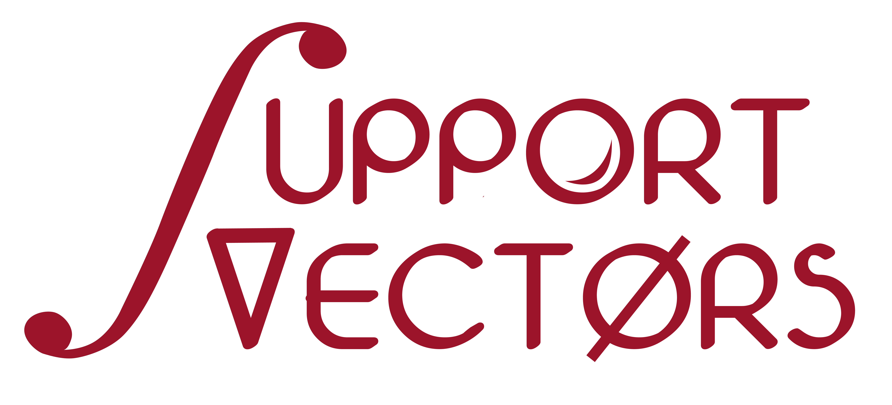

---

# An Introduction to AI: Neural-Nets, LLMs and Gen AI

This workshop focuses on in-depth expertise in dominant neural network architectures, large language models, and transformer architectures. In this sixteen-week course, you will develop an understanding and fluency in one facet of this fascinating field each week.

| Activities                    | Timing and Details                                           |
| ----------------------------- | ------------------------------------------------------------ |
| Main Sessions             | Meets every Tuesday and Thursday evenings; from 7 PM PST     |
| Lab access                | Lab hardware resources are available 24/7 for the duration of the course. |
| Help sessions             | Every day by appointment.                                    |
| Lab solutions walkthrough | The teaching staff AI engineers will announce their sessions on an ongoing basis. |
| Quiz                      | There will be two quizzes on each topic. The teaching AI engineers will hold review sessions to explain the solutions. |

#### Course Description

This course is designed to introduce students to the foundational and advanced concepts of artificial intelligence, with a focus on neural networks, large language models, and generative AI. Through a combination of lectures, hands-on coding exercises, and project work, students will gain a deep understanding of the mathematical and technical underpinnings of AI technologies. They will explore the theory behind neural networks, delve into various architectures, and understand the applications and implications of AI in the real world.

#### Course Objectives

Understand the mathematical foundations of AI, including the universal approximation theorem.
Learn about activation functions, back-propagation, regularization,and optimization techniques.
Explore various neural network architectures, including feed-forward nets, CNNs, RNNs, and Transformers.
Gain hands-on experience with Autoencoders, GANs, Diffusion Models,Normalized Flows, and Energy Models.
Apply knowledge in practical coding exercises and projects to solve real-world problems.
In-depth study of various transformer based architectures